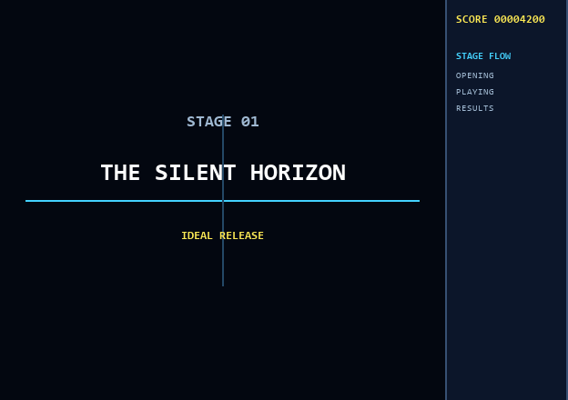

# goat-shooooting

goat-shooooting は、JSON で定義した Player、Enemy、Weapon、Bullet、Stage を読み込み、MonoGame 上で動作させる小さな 2D シューティング基盤です。プレイヤーと敵の双方が射撃でき、被弾による Game Over、敵全滅による Stage Clear、リトライまでを1プレイとして実行できます。ゲームロジックは描画から独立しており、同じ Production Runtime を headless simulation、統合テスト、smoke test、通常ゲームのすべてで使用します。

遊び方から独自の弾・敵・ボス・Wave・画面レイアウトの作り方、エンジン拡張までをまとめた[制作マニュアル](https://atoyr.github.io/goat-shooooting/)を公開しています。

## 必要環境

- .NET 8 SDK（`global.json` は 8.0 系の利用可能な最新 feature band を選択）
- 通常ゲームの実行時のみ、OpenGL 2.0 以上を利用できるデスクトップ環境
- NuGet の初回 restore 時に `MonoGame.Framework.DesktopGL` 3.8.5.1 と xUnit 関連パッケージを取得できること

ゲーム画像などの外部 Asset は不要です。Player、Enemy、Bullet は実行時生成した 1 ピクセル Texture から単純な図形として描画します。

## Build と Test

リポジトリルートで実行します。

```bash
dotnet restore
dotnet build
dotnet test
```

テストには ECS の基本操作、各 System の単体テスト、JSON 検証、Definition 変更テスト、ゲーム全経路の End-to-End Integration Test が含まれます。

Definitionだけを検証する場合:

```bash
dotnet run --project src/goat-shooooting.Tooling -- validate games/sample
dotnet run --project src/goat-shooooting.Tooling -- validate games/gauntlet
```

成功時はコンテンツ数を表示してexit code 0、不正な参照・値・未知のプロパティ・JSON構文エラーはファイル、JSON Path、行・バイト位置を可能な範囲で表示してexit code 1を返します。

## SampleGame

通常起動:

```bash
dotnet run --project src/goat-shooooting.SampleGame
```

高速・縦長構成の第2コンテンツパックを起動:

```bash
dotnet run --project src/goat-shooooting.SampleGame -- --game gauntlet
```

操作:

- Arrow / WASD: Player 移動
- Z / Space: 発射
- X / Shift: ボム
- P: ポーズ／再開
- R / Enter: Game Over／Stage Clear後にリトライ
- Esc: 終了

約60秒のステージ中にScout、Fighter、Midbossが複数Waveで出現します。Scoutは直進弾、Fighterは追尾弾、Midbossは二層式洗濯機弾幕を使用します。被弾するたびに残機が1減り、0になるとGame Over、Player BulletでEnemyをすべて倒すとStage Clearです。ボムは全Enemyへ一斉にダメージを与え、画面内のEnemy Bulletを消去します。被弾後には短い無敵時間があり、命中フラッシュ、撃破エフェクト、手続き生成した効果音、画面揺れで結果を伝えます。プレイヤーはColliderを含めて画面内に制限され、画面外へ完全に出た敵と弾は自動的に削除されます。残機・ボム数はプレイ領域左上、スコアは設定した位置へ常時表示され、現在の残機・ボム数・スコア・Pause／終了状態はウィンドウタイトルにも表示されます。

画面を使わない smoke test:

```bash
dotnet run --project src/goat-shooooting.SampleGame -- --smoke-test
dotnet run --project src/goat-shooooting.SampleGame -- --game gauntlet --smoke-test
```

このモードは JSON 読込後に Production の `ShootingSimulation` を一定フレーム進め、Enemy spawn、双方のBullet spawnと移動、Collision、Damage、Enemy death、Stage Clear、リトライと状態初期化を観測して自動終了します。成功時は exit code 0、検証失敗または例外時は exit code 1 です。

## Project 構成

```text
goat-shooooting.sln
src/
  goat-shooooting.Core          Entity、World、状態のみを持つ Component
  goat-shooooting.Definitions   静的 Definition、検証、JSON／memory repository
  goat-shooooting.Runtime       Factory、System、headless ShootingSimulation
  goat-shooooting.Framework     MonoGame の Keyboard／描画 adapter と Game host
  goat-shooooting.SampleGame    通常起動と production smoke-test の entry point
  goat-shooooting.Tooling       Definition検証CLIとブラウザEditor
tests/
  goat-shooooting.Core.Tests
  goat-shooooting.Runtime.Tests
  goat-shooooting.Framework.Tests
  goat-shooooting.IntegrationTests
  goat-shooooting.Tooling.Tests
games/sample/                  60秒の標準コンテンツパック
games/gauntlet/                高速・縦長の第2コンテンツパック
schemas/                       各DefinitionのJSON Schema
```

依存の向きは次のとおりです。

```text
JSON Definition -> IDefinitionRepository -> Factory
                                      Factory -> Entity + Component -> System
MonoGame Input ----------------> IInputState -> ShootingSimulation
ShootingSimulation -> RenderSystem snapshot -> MonoGame renderer
```

`Core` と `Runtime` は MonoGame に依存しません。Runtime はファイル API や `JsonSerializer` を直接使わず、`IDefinitionRepository` だけを参照します。Entity と Component は update／draw ロジックを持たず、処理は System にあります。

## Definition Editorとホットリロード

ブラウザベースのEditorを起動します。既定では `http://127.0.0.1:5078` を開きます。

```bash
dotnet run --project src/goat-shooooting.Tooling -- editor games/sample
```

Editorはビジュアル編集を標準モードとして提供します。左側からゲーム素材を選び、右側の日本語フォームで値を変更すると、Player、Enemy、Bullet、Weaponの見た目・軌道・弾幕が中央へ即時プレビューされます。Stageでは、下部タイムラインの時刻を選ぶと、その時刻に出現するEnemyだけが中央キャンバスへ表示されます。Enemyをドラッグして出現位置を変更でき、イベントの追加、複製、削除、出現時刻、編隊数、間隔も画面操作で設定できます。

JSONを直接調整したい場合だけ、上部の`JSON`へ切り替えます。新しいEnemy、Bullet、Weapon、Stageは左上で種類を選んで`＋ 新規`を押し、IDを指定して作成します。`検証`は保存せずコンテンツパック全体を確認し、`保存`は参照を含めて正常な場合だけ実ファイルを置き換えます。`../`などでゲームディレクトリ外へアクセスすることはできません。

Schemaは [`schemas`](schemas) にあります。通常のSampleGameはJSON内容のハッシュを毎フレーム確認します。Editorなどで正常な変更を保存するとDefinitionとWorldを自動的に再構築し、不正な変更の場合は最後に正常だった状態で動作を継続してウィンドウタイトルへエラーを表示します。

## Definition の追加・変更

サンプルの定義は [`games/sample`](games/sample) にあります。

- `game.json`: 使用する `playerId`、`stageId`、プレイ領域サイズ、画面レイアウト、スコア位置
- `player.json`: 残機、ボム数と威力、移動速度、初期位置、Collider 半径、被弾後の無敵時間、Weapon 参照
- `enemies/*.json`: Enemy の HP、移動速度、Collider 半径、スコア、任意の Weapon 参照、`straight`／`sine`／`zigzag`移動
- `bullets/*.json`: Bullet の速度、Damage、Collider 半径、Lifetime、`straight`／`homing`移動
- `weapons/*.json`: Bullet 参照、cooldown、弾数と`spread`／`washing-machine`／`double-washing-machine`弾幕
- `stages/*.json`: タイトル、開始／リザルト表示時間、次Stage、時刻付き `spawn-enemy` event、ボス指定、出現位置と編隊

新しい JSON を対象フォルダーへ追加し、一意な `id` で参照してください。Engine コードの変更は不要です。起動時に全参照と値を検証するため、不明な Player／Stage／Enemy／Weapon／Bullet ID、重複 ID、未対応 event、0 以下の HP などは `DefinitionValidationException` になります。

Stageは`nextStageId`で連結します。`openingDuration`中はタイトルと副題を表示して戦闘を停止し、`isBoss: true`のイベントで出現した敵をすべて倒すとステージ別スコアと累計スコアを`resultsDuration`秒表示して次へ進みます。`nextStageId`を省略したStageのリザルト後が全ステージクリアです。



```json
{
  "id": "stage-01",
  "title": "THE SILENT HORIZON",
  "subtitle": "IDEAL RELEASE",
  "openingDuration": 3,
  "resultsDuration": 4,
  "nextStageId": "stage-02",
  "events": [
    {
      "time": 60,
      "type": "spawn-enemy",
      "enemyId": "midboss",
      "x": 400,
      "y": 90,
      "isBoss": true
    }
  ]
}
```

例:

```json
{
  "id": "fighter-b",
  "hp": 30,
  "speed": 80,
  "radius": 16
}
```

追尾弾は Bullet 側で設定します。`homingTurnDegreesPerSecond` が小さいほど緩く、大きいほど強く曲がります。

```json
{
  "id": "enemy-homing-shot",
  "speed": 90,
  "damage": 2,
  "radius": 7,
  "lifetime": 8,
  "movementPattern": "homing",
  "homingTurnDegreesPerSecond": 75
}
```

洗濯機系は Weapon 側で設定します。`projectileCount` は渦の腕数、`rotationDegreesPerShot` は発射ごとの回転角、`rotationSwitchShots` は左右反転までの発射回数です。`double-washing-machine` は逆方向へ回る二つの層を同時に発射するため、実際の同時弾数は `projectileCount` の2倍です。

```json
{
  "id": "boss-washer",
  "bulletId": "enemy-shot",
  "cooldown": 0.45,
  "projectileCount": 2,
  "firePattern": "double-washing-machine",
  "rotationDegreesPerShot": 11,
  "rotationSwitchShots": 18
}
```

Enemy の `weaponId` にこの Weapon ID を指定するだけで、敵ごとに弾種と弾幕を切り替えられます。

画面レイアウトは `game.json` で選択できます。`width` と `height` はどのレイアウトでもプレイ領域の大きさなので、レイアウトを切り替えてもStageの座標や当たり判定は変わりません。

- `full`: パネルなしの従来レイアウト
- `touhou`: プレイ領域＋右HUDパネルの左右2分割
- `donpachi`: 左HUDパネル＋中央プレイ領域＋右HUDパネルの3分割

```json
{
  "playerId": "player-one",
  "stageId": "stage-01",
  "width": 800,
  "height": 720,
  "screenLayout": "touhou",
  "hudPanelWidth": 220,
  "scorePosition": "right-panel"
}
```

`scorePosition` は `playfield-top-left`、`playfield-top-right`、`left-panel`、`right-panel` から選択します。`left-panel` は `donpachi`、`right-panel` は `touhou` または `donpachi` で使用できます。Definition Editorではレイアウトとスコア位置をプレビューしながら選べます。

```json
{
  "time": 7.5,
  "type": "spawn-enemy",
  "enemyId": "fighter-b",
  "x": 240,
  "y": 100,
  "count": 3,
  "spawnInterval": 0.25,
  "spacingX": 80
}
```

同一のRuntimeで両コンテンツパックが使う必要性から、敵のサイン移動、Bulletの追尾、Weaponの扇状／洗濯機／二層式洗濯機射撃、Stage eventの繰り返しSpawn、ボス撃破を起点とするStage遷移をDefinition化しています。未使用のドロップ、複数武器スロットはまだ抽象化していません。

## 現在の Architecture

- **Definition**: immutable-style record による静的設定。Runtime state は保持しません。
- **Factory**: `PlayerFactory`、`EnemyFactory`、`BulletFactory` が Definition を Entity＋Component へ変換します。
- **Entity / Component**: 継承階層を使わない composition model です。`Transform`、`Velocity`、`Lives`、`Bomb`、`Health`、`Damage`、`Collider`、marker、Weapon、Lifetime を World が管理します。
- **System**: 入力、射撃、ボム、移動、境界、Stage、Collision、Damage、無敵時間、Feedback、Lifetime、Cleanup、Renderをそれぞれ独立したSystemが処理します。
- **Runtime**: `ShootingSimulation.Update(deltaTime)` が production実行順序、Pause、`Running`／`StageClear`／`GameOver` の状態遷移、リトライ時のWorld再構築を統括します。1フレーム単位の `SimulationFeedback` は描画APIに依存しません。
- **Framework**: `KeyboardInputState`、`ShootingGame`、手続き生成音を扱う`GameAudio`だけがMonoGame APIを扱います。RenderSystemはrenderer-neutralなsnapshotを返し、Frameworkがフラッシュ、爆発、画面揺れ、残機・ボム数と状態表示へ変換します。

現在の範囲はPlayer／Enemyによる射撃、直進／サイン移動、追尾弾、扇状／洗濯機系弾幕、Wave、Damage／Death、勝敗とリトライ、Definition制作支援までです。networking、save、独自Script言語や高度なECS最適化は含みません。
